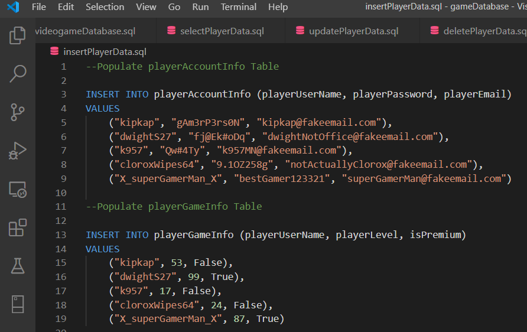
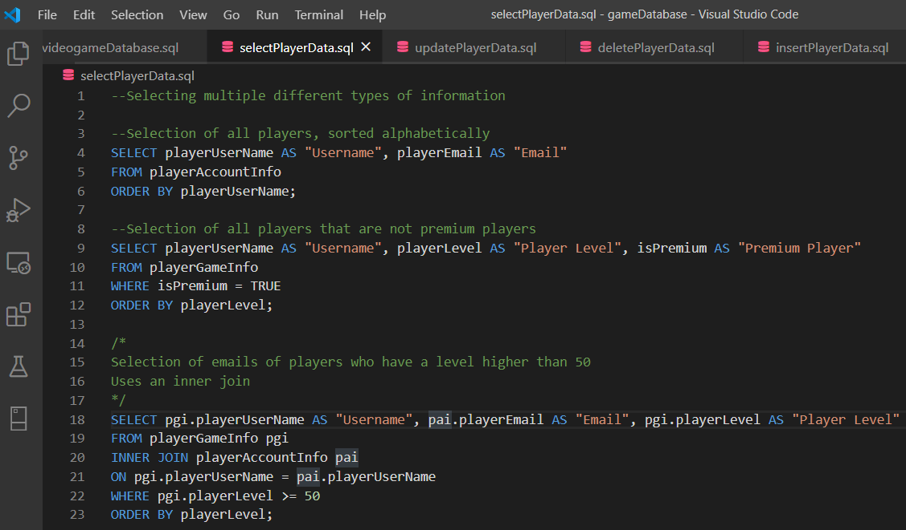
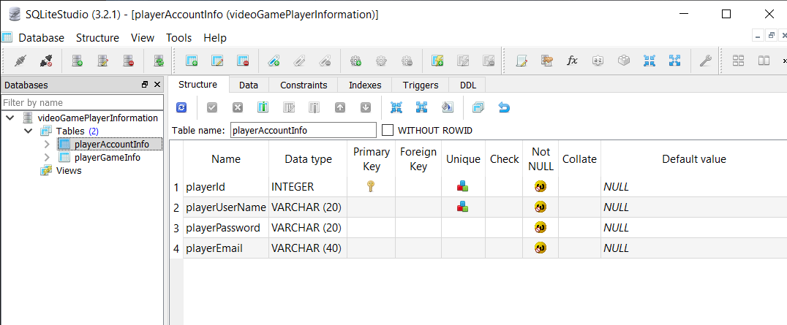

# Overview
A collection of MySQL Scripts that can be run on the included database (run the creation script first). The database and scripts simulate the information that may be stored for an online game

# Developement Enviroment

* Visual Studio Code
* SQLite

# Execution

To run the different scripts, open SQLite and run the scripts in the script executor

# Useful Information

[MySQL information and assistance](https://www.w3schools.com/sql/)
[SQLite information and install help](https://www.sqlitetutorial.net/sqlite-getting-started/)